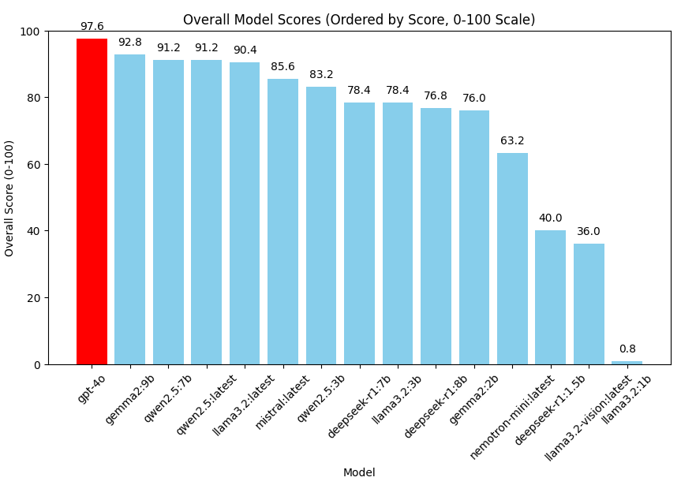

**No aspect of this repository constitutes legal advice.**

# PrivacyBench - Personal Data Identification and Redaction Task

## Executive Overview and Summary of Results
- In this task we used GPT-4o to benchmark the performance of LLMs small enough to be run on a workstation in simple redaction task.
- **Model Testing Prompt**: Each model was tested on its ability to identify personal data in a text snippet and replace it with placeholders according to this prompt: 
    > "Examine the following text excerpt and redact all information that you would associate with an identified or identifiable individual human and therefore qualifies as personal data. For redaction, replace each piece of personal data with a placeholder that indicates the type of data has been removed (e.g. [NAME])."
- This prompt is intentionally vague to see if the models are capable of identifying non-standard or ambiguous forms of personal data without specific prompting of categories.
- Even the best performing small models were prone to redact company names (when not personal) or generic email addresses like info@example.com.
- For a grading report generated based upon model performance discussing tendencies of each model, see the `pii_redaction_task` folder in this repository. For example, [this GPT-generated grading summary of Gemma2:9b](../pii_redaction_task/grading_summary-gemma2-9b-gpt-4o-privacybench_PII_redaction.txt).

## Challenges of redacting PII

- Privacy laws broadly define personal data as any information that can identify an individual, depending on context and current technology (such as AI).
- It can be impossible even for a human to identify to distinguish between company and personal names in some cases.
- Certain models, particularly small llama models, refuse to attempt to redact (probably for privacy reasons). 

## More to Do
- Testing larger language models.
- Testing redaction on larger text sample blocks.
- Testing general legal and privacy knowledge.
- Testing additional legal tasks.
- Human grading of models and review of testing standards for more precise benchmarking.

## Detailed Benchmarking Methodology - Personal Data Redaction

1. **Question Set Preparation**

    - We maintain a JSON file (`privacybench_pii_redaction.json`) containing 25 test questions. Each question prompts the model to perform redaction of personal data.
    - Each question provides a reference `correct_answer` for grading purposes, so we can compare how well the model’s redactions matched the expected approach.

2. **Execution of Tested Models**

    - The script defines a list of `TESTED_MODELS`, each identified by a model name or endpoint.
    - For every model in that list, a pipeline function (`run_pipeline_for_model`) runs each question in `privacybench_PII_redaction.json` against the model.
    - The model is prompted with a fixed format that includes instructions ("Examine the text excerpt and redact...").
    - The script logs each model’s response, along with the runtime, to a JSON file.

3. **Judging Model (Grading)**

    - A separate model, labeled `JUDGING_MODEL` (e.g. `gpt-4o`), is used to score each response. The judging model is an AI model specifically tasked with evaluating and scoring the redaction performance of other models.
    - The script passes the question, the model’s response, and the expected answer to the judging model with a standardized grading prompt.
    - The judging model outputs a rating from 0 to 5 and provides a short justification. That raw text is captured and stored.

4. **Conversion to Numeric Scores**

    - A function parses the judging model’s textual score, extracting the numeric grade (0–5). This numeric grade is then converted to a percentage (0–100) using the formula `(grade / 5.0) * 100` to standardize the scores for easier comparison.
    - The script converts that 0–5 scale into a 0–100 range by `(grade / 5.0) * 100`.
    - The numeric results are stored in a separate JSON file, making it easier to visualize or compare performance.

5. **Aggregation and Reporting**

    - The script compiles all tested model results into an overall "score report," which captures both per-question results and an overall average for each model.
    - The final script (`compile_score_report()`) creates a JSON file containing each model’s average score, as well as a breakdown of each of the 25 questions.
    - Optionally, `run_grading_summary()` uses the same judging model to produce a short narrative about each model’s strengths and weaknesses, based on the aggregated results.

6. **Result Visualization**

    - A separate script (`plot_results.py`) handles plotting the results (`matplotlib`-based bar charts and line graphs). It reads the "score_report-*.json" files and generates:
      - **Overall Scores Bar Graph**: showing each model’s total average score.
      - **Average Score per Question**: illustrating question difficulty or how well most models handled a question.
      - **Per-Question Performance Curves**: a spline-interpolated line chart for each model, highlighting performance patterns across the 25 questions.

## What It Demonstrates

- How to orchestrate a repeatable pipeline that tests multiple AI models.
- How to use a specialized "judge" model to systematically evaluate and score each model’s performance.
- How to automate the entire workflow, from generating answers to compiling final performance summaries, ensuring consistent measurement across models.

## Caveats
- The performance benchmark is influenced by the correctness of the grading model.
- Real-world personal data redaction remains context-dependent, and no automated approach is guaranteed to be 100% correct.

## Summary

- This workflow provides a systematic approach to evaluating how well AI models redact personal data.
- By standardizing questions, collecting responses, using a single judging model, and generating visual reports, we can compare relative performance across multiple large language models.

