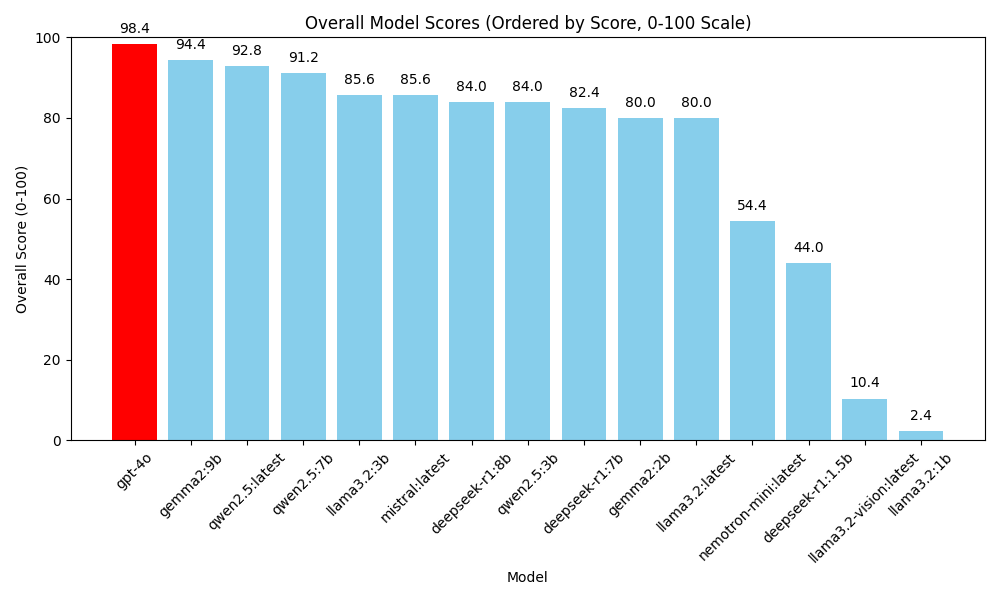

# PrivacyBench - Personal Data Identification and Redaction Task

## Executive Overview and Summary of Results
- Several models that are small enough to be run on a modest PC or Mac workstation were tested on 25 redaction tasks with exactly the same prompts and parameters, and the results show the relative skills of these models in terms of finding personal data and successfully redacting it from the sample usage data.
- The automated test pipeline uses GPT-4o to 'judge' the results according to consistent standards, and then uses the same model to judge itself for comparison.  The metrics include per-question scores, score summaries, and a auto-generated textual narrative of model strengths and weaknesses.
- Gemma2:9B shows remarkable performance given its size. It nearly matches GPT-4o's performance at this task, despite being a much smaller model that can be run on the modest processing resources of a decent workstation. This makes it a possible good candidate for additional fine-tuning to the specific task to further improve its scoring. Its most significant error is that it identified a generic email address as personal data ([info@example.com](mailto:info@example.com)) and redacted it, which is a conservative error.
- Gpt-4o performed very well, but interestingly found flaws in its own output.
- To review AI-generated summaries of each model's performance see the pii_redaction_task folder in the repo, for example ]

## Explanation

In this figure, gpt-4o is used as the overall judge of the output of both itself and the other models. Gpt-4o, being a much larger and more intelligent model than locally-hosted models of 8B parameters and smaller, is a reasonable judge of performance.

## Problem to Be Solved

- Businesses want to be able to use usage data in software and SaaS applications in order to improve their services for customers, but restrictons on personal data use and risks to consumers cause risk of violating regulatory standard and breach of data.
- Older technology like Regular Expression are very effective at consistently identifying patterns in data (such as 3 digits, a dash, two digits, a dash, and then three digits for a SSN), but they fail at identifying and categorizing personal data given the broad definition of personal data/information under most laws and frameworks.
- The industry currently lacks a transparent mechanism for rating the effectiveness of LLMs at identifying, categorizing, and redacting personal data, and also lacks specialized LLMs that could be potentially.
- The costs of engineering privacy enhancing technology (PET) can be prohibitive without a clear way of measuring success, or identifying promising models with which to begin development.

## Challenges

- Privacy laws have broad definitions of personal data that indicate that any information that relates to an identified or identifiable living human is personal data.  Whether something is personal data is dependent upon the context, which is something LLMs excel at understanding.
- Standards such as GDPR benchmark whether data is 'identifiable' based upon the 'state of the art', thus it may be useful to use the context=aware power of generative AI to police itself.
- Privacy Enhancing Technology, particularly using AI, should be effective, useful, purpose-built, and trustworthy.

## More to Do
- Testing larger language models.
- Testing general legal and privacy knowledge.
- Testing additional legal tasks.
- Human grading of models and review of testing standards for more precise benchmarking.

## Detailed Benchmarking Methodology - Personal Data Redaction

1. **Question Set Preparation**

    - We maintain a JSON file (`privacybench_PII_redaction.json`) containing 25 test questions. Each question prompts the model to perform redaction of personal data.
    - Each question provides a reference `correct_answer` for grading purposes, so we can compare how well the model’s redactions matched the expected approach.

2. **Execution of Tested Models**

    - The script defines a list of `TESTED_MODELS`, each identified by a model name or endpoint.
    - For every model in that list, a pipeline function (`run_pipeline_for_model()`) runs each question in `privacybench_PII_redaction.json` against the model.
    - The model is prompted with a fixed format that includes instructions ("Examine the text excerpt and redact...").
    - The script logs each model’s response, along with the runtime, to a JSON file.

3. **Judging Model (Grading)**

    - A separate model, labeled `JUDGING_MODEL` (e.g. `gpt-4o`), is used to score each response.
    - The script passes the question, the model’s response, and the expected answer to the judging model with a standardized grading prompt.
    - The judging model outputs a rating from 0 to 5 and provides a short justification. That raw text is captured and stored.

4. **Conversion to Numeric Scores**

    - A function parses the judging model’s textual score, extracting the numeric grade (0–5).
    - The script converts that 0–5 scale into a 0–100 range by `(grade / 5.0) * 100`.
    - The numeric results are stored in a separate JSON file, making it easier to visualize or compare performance.

5. **Aggregation and Reporting**

    - The script compiles all tested model results into an overall "score report," which captures both per-question results and an overall average for each model.
    - The final script (`compile_score_report()`) creates a JSON file containing each model’s average score, as well as a breakdown of each of the 25 questions.
    - Optionally, `run_grading_summary()` uses the same judging model to produce a short narrative about each model’s strengths and weaknesses, based on the aggregated results.

6. **Result Visualization**

    - A separate script handles plotting the results (`matplotlib`-based bar charts and line graphs). It reads the "score_report-*.json" files and generates:
      - **Overall Scores Bar Graph**: showing each model’s total average score.
      - **Average Score per Question**: illustrating question difficulty or how well most models handled a question.
      - **Per-Question Performance Curves**: a spline-interpolated line chart for each model, highlighting performance patterns across the 25 questions.

## What It Demonstrates

- How to orchestrate a repeatable pipeline that tests multiple AI models.
- How to use a specialized "judge" model to systematically evaluate and score each model’s performance.
- How to automate the entire workflow, from generating answers to compiling final performance summaries, ensuring consistent measurement across models.

## Caveats

- No aspect of this repository constitutes legal advice.
- The performance benchmark is influenced by the correctness of the grading model.
- Real-world personal data redaction remains context-dependent, and no automated approach is guaranteed to be 100% correct.

## Summary

- This workflow provides a systematic approach to evaluating how well AI models redact personal data.
- By standardizing questions, collecting responses, using a single judging model, and generating visual reports, we can compare relative performance across multiple large language models.

